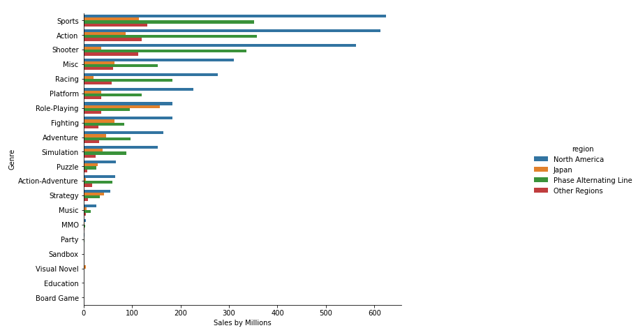
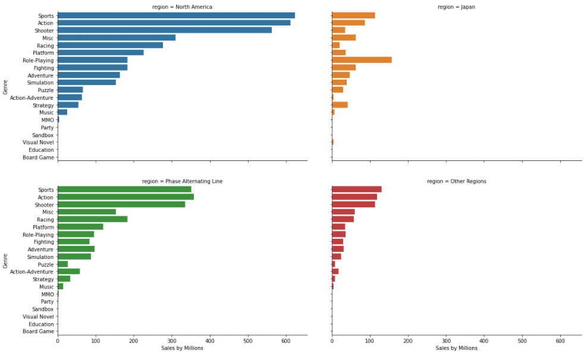
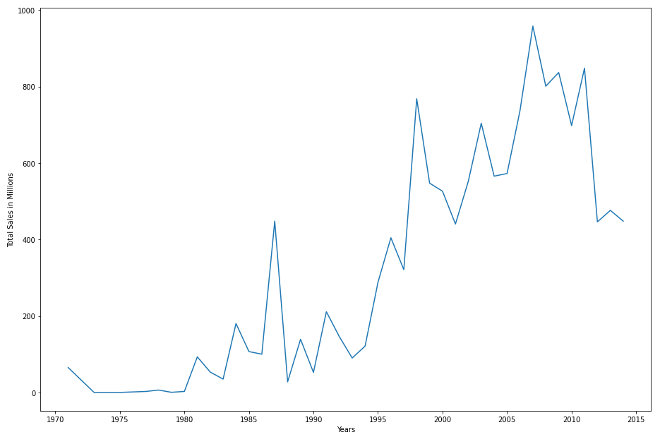
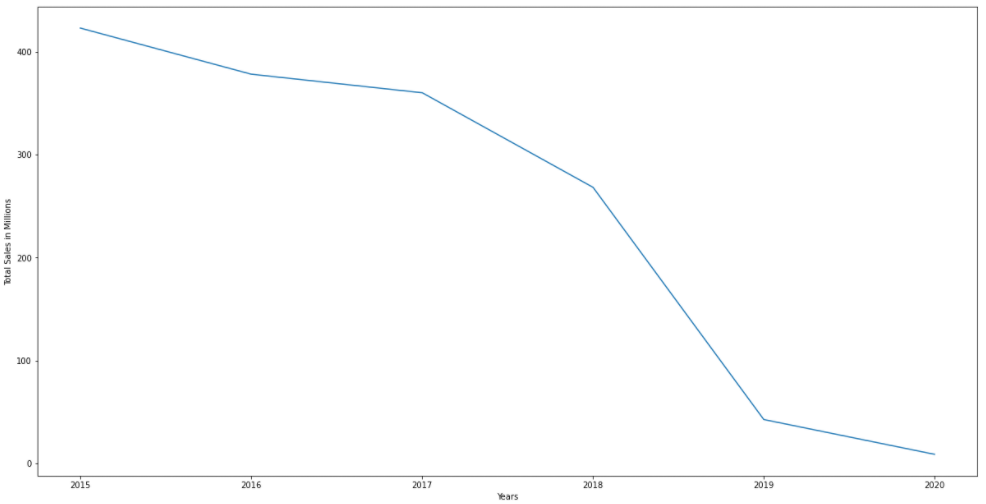
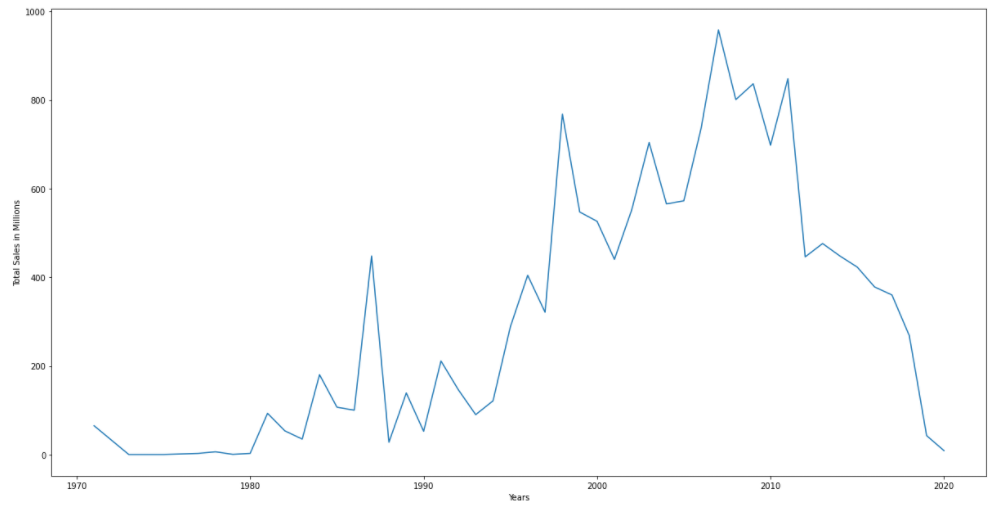

# Video Game Sales

## Motivation
  
Video games has served the purpose as a way to escape the real world and into an imaginary world where people can focus on something they truly enjoy. It has become something allows us to de-stress and have fun while playing. It has also allowed friends and strangers to interact or play with each other creating stronger bonds no matter where you are in the world. This is more evident especially during these times of quarantine where people cannot simply meet each other. These video games gave a platform to people to continue to interact with each other and enjoy everyones presence even if it is just online. Video games has also lead to thousands of jobs around the world from game developers, to professional e-sport atheletes, and to livestreamers. Video games has opened countless opportunities for people to experience.
  

Over the past few decades, video games have slowly taken over the world by storm. From the introduction of the first commercially successful video game "Pong" to the present day cloud gaming services. The gaming industry has been alive for only around 49 years but it has become one of the largest profitable markets in the world. According to the Visual Capitalist, in 2020, the gaming industry was estimated to have earned a revenue of $165 billion. Gaming has become the biggest entertainment market by beating markets like television, film box office, and digital music. Through innovation and constant increase in popularity, it is said that its revenue forecast will hit $291 billion by 2027. It has been a couple of years now that the gaming industry has dominated the world market and has become a more accepted aspect of life for a majority of people around the world.

The visualization below (Made by Pelham Smithers) shows the rise of revenue earned by the gaming industry over the 49 year life span. It shows how different consoles affected the market by gaining pieces of it over the years. It also shows important releases made over the decades.
  

The speed of how fast the gaming industry has grown has peaked the interest of our group hence we wanted to dwell deeper into the video game sales. We wanted to find out the different players or factors that come into play when it comes to high successful sales. We want to be able to find certain trends within the video game sales. We also want to find out who are the top conteders in their own category. Through this, we might be able to see what can make a successful game.
  

## Datasets Used

Before we dive into exploring the data regarding video game sales, we want to explain first the data set that we used. A data set is basically a file that contains thousands of information regarding a certain topic. For this research, we looked through a free public data set library website called Kaggle which allows people to download data sets provided by other people. After a bit of searching, we found a particularly good data set simply called Video Game Sales 2019. It contained all the information we needed. It had over 55,000+ games and had information like the game's genre, publisher, sales numbers, and esrb rating. 

The way the author (Abdulshaheed Alqunber) collected this data is through an automated trick called web scrapping wherein you write a certain script that will go through a specific website and collect information from it. The author based his web scrapping script of GregorUT's script which utilizes the Python library called "BeautifulSoup" which is a web scrapping library. They wanted to collect data from a verified source which is why they chose to scrape the data from VGChartz.com which is a public website that holds statistics on thousands of games from their release dates, to genres, and to their sales. So with that, they developed the script that went through the entire website and collected the data they needed. This is how the data that you will see later in the database was collected. This entire process may seem a bit sketchy but the authors made sure that what they are doing is legal and allowed by the website owners.

After getting the Video Game Sales 2019 dataset, we thought if we could possibly get a more updated database since the 2019 version is 2 years old already. The first thing that we did is to try to use the web scrapping script that the authors published in order to scrape the information ourselves. However, after thinkering and setting up the scripts, they didn't seem to run as intended. The script kept crashing and we noticed that the problem was related to the proxy server that we needed to use in order to connect to the site. After multiple failed attempts to find a working proxy, we decided to look for a more updated dataset in Kaggle. Thankfully, we were able to find a more recent version. 

The data set is called Video Game Sales 2020 which was based off the 2019 but was published by a different author. This version collected its data on July 7, 2020. We were happy with this update already. The biggest difference between the two datasets is that the 2020 version lacks the ESRB Ratings for the games. ESRB Ratings are essentially age-restriction labels placed by the ESRB Organization. This rating helps identify what age group can play said game. With this, we decided to just merge both the 2019 and the 2020 data sets together to create an updated complete dataset. Doing so allowed us to properly analyze and process the data easily. 

Video Game Sales 2019: https://www.kaggle.com/ashaheedq/video-games-sales-2019

Video Game Sales 2020: https://www.kaggle.com/baynebrannen/video-game-sales-2020

VGChartz Web Scrapping Script: https://github.com/GregorUT/vgchartzScrape

VGChartz Database Website: https://www.vgchartz.com/gamedb/

Now that we have our complete data set, we will now try to clean, analyze, and process the data so that it can be more useful for us later down the line.

## Cleaning & Analyzing The Data

Aside from merging the two datasets together we had to do some cleaning in the data set since we noticed some weird things. The first thing that we did is to check the number of "null" or empty values there are for each column. We noticed that there are some columns that had a lot of missing data. We needed to fill in this data somehow in order to have more consistent data. We did two major things to change the data. 

First is that we created a new column called "Total Sales". It can be noticed that there are 6 different columns that have sales value. So we decided to combine them into one column to show the total sales for that specific game title. The columns are total_shipped, global_sales, na_sales, jp_sales, pal_sales, and other_sales. We noticed that if total_shipped exists, global_sales doesn't and vice versa. So if either of them exists, then that becomes the total sales value. However, if neither exist, we added the sales from the four regional sales to create the total sales. After that, we were able to get a better view of the sales for each game.

The second adjustment we did was regarding the ESRB Rating, we noticed that there is a gigantic percentage of it that is missing data and might skew the results later down the line. At first we tried to look for other data sets that we can use to merge with our complete data set but we were not able to find a data set that had a similar format to ours. Others had more complex rating systems, different game title formatting, or even just a lack of games in general. So what we decided to do is to manually find the ESRB Rating for each of the game that had a total sale that is not 0. This was a tedious process since there were thousands of data points that we had to fill in. What added to the trouble is that there were games with no official rating so we were forced to leave them empty. In the end, we were able to fill up a good chunk of the missing data which we think is enough for our analysis down the line. 

After dealing with the empty values, we then removed some useless columns that did not help our analysis. We dropped the "Unnamed: 0", "img", and "last_update" columns since we didn't need their data anyways. With that, we finished processing our data set. The next section will explain the contents of the final data set.

## Contents of the Data Set

The data set has the following features

- 55845 games (36808 unique game titles)
- 77 unique consoles
- 20 unique genres
- 8 unique ESRB Ratings
- 3141 unique publishers
- 8189 unique developers
- 17 different feature columns

Each column has its own definition which is listed below.

- title - Name of the game
- console - The specific console the game is running on (PC, PS4, XBox, etc.)
- genre - The specific genre of the game (Action, MMO, Adventure, etc.)
- publisher - The company that published/distributed the game
- developer - The company that developed the game
- vg_score - The game rating provided by VGChartz
- critic_score - The game rating provided by game critics
- user_score - The game rating provided by the players
- total_shipped - Total copies solid (in millions)
- global_sales - Total sales earned (in millions)
- na_sales - Sales from North America (in millions)
- jp_sales - Sales from Japan (in millions)
- pal_sales - Sales from PAL (Most of Europe, Asia, Oceania, etc.) (in millions)
- other_sales - Sales from the rest of the world (in millions)
- release_date - The date the game was released
- ESRB_Rating - The official ESRB rating provided (Age restriction) (Everyone, Teen, Mature, etc.)
- Total_Sales - The total amount of sales earned by the game

With all the data available, we can finally do some analysis

## Exploratory Data Analysis (EDA)

To guide our analysis we created 10 research questions that we wanted to answer by the end of this study. The questions are as follows:

- What genre of games have the highest sales?
- What kind of ESRB ratings do top selling games have?
- Which publishers have received the most sales?
- What are the sales trends of certain games in different regions?
- Do certain regions lean towards specific game genres?
- On what platform do games receive more sales?
- What is the relationship between the critic & user scores to the game’s sales?
- Are newer games able to compare against older games with sales?
- What is the trend of newer video game releases per console?
- What are the top genres for the ESRB Ratings

We will be going through each question one by one and showing different visuals and how we understood the data.

### What genre of games have the highest sales?

In this graph we show the top 20 genres and their total sales. The top 3 genres are shooter, sports, and action. These results are not surprising since franchises such as the Call of Duty series, the FIFA/2K series, or the BioShock series have been popular titles in their own genres. They have been releasing multiple titles under the same name which has lead to a hardcore following where fans keep buying the next series. This further increases the popularity of the genre which leads to even more games being developed in order to lure these fans to other games of the same genre. 

On the otherhand, the genres with the lowest sales are MMO, Visual Novel, and Board Games. I would believe that MMOs and Board Games actually have high sales but must not have been included in the data set that we are using. Visual novels though is reasonable since majority of visual novels are from Japan and have a rather smaller niche community compared to the fans of shooter games.

This graph shows how more action-related genres have more sales than the rest.

###  What kind of ESRB ratings do top selling games have?

###  Which publishers have received the most sales? (Ky)
This section shows the top 10 publishers according to their total sales. As seen in the graph, the top 3 Publishers according to our data is Nintendo, Activision, and Electronic Arts. It makes sense that Nintendo takes the number one spot because the company has been around for a while. Nintendo was founded around 130 years ago (September 23, 1889). They have been releasing their games for a long time which leads to more sale for their company. Activision also takes the top spot which we think is only possible because of ther continuous release of the Call of Duty Series. They release a new Call of Duty once every few years which makes their sales go higher.

###  What are the sales trends of certain games in different regions?

These graphs show the top 10 games according to their total sales per region. 

For the NA graph, the games that showed up are understandable since NA is more into the shooter, action, adventure genre of games such as Grand Theft Auto and Call of Duty. These game titles have been popular in NA for quite some time now. Culturally speaking, Americans are more laxed when it comes to guns and violence which can probably explain why such genres are popular.

For the JP graph, these are games mostly developed and released in Japan hence it has more japanese sales. Grand Theft Auto can be seen within the chart but the other Japanese games are still dominating the region. These games are a bit more tame compared to the games in NA since they are mostly adventure or fighting games.

For PAL on the other hand, it is similar to the interests of the NA region except for the dominance of the sports genre, especially FIFA. FIFA holds a big portion of sales within the PAL region. The sports genre is famous around the European, South American, and South African areas, hence the growth of the sports genre in the region. 

Lastly, for the other regions, it is similar to the trends for the NA region with shooters and action games taking a big portion of the top 10. Majority of the trends in other countries replicate the trends of NA as well since they are the games that are usually more popular and receive more attention.

Overall, titles such as Grand Theft Auto and Call of Duty have been consistent in the 4 provided regions. Which can also explain the amount of sales genres like shooters and action are getting. These games have a big following all throughout the world. 

###  Do certain regions lean towards specific game genres?

In terms of game sales, there are 4 "regions" namely Japan(JP), North America(NA), Phase Alternate Line or PAL, and other regions not included in the first 3. In the first graph seen, all 4 regions highly gravite towards Sports Genre. This is understandable because Sports video games like NBA and FIFA release games every year and also on special events.

Upon closer inspection, the top genre for each region slightly differs. For JP, the top genre would be Role-Playing while Sports in only second. For PAL, Action is the top genre while Sports is also only second. For both NA and other regions, Sports is the top while Action places second. Action being one of the top selling genres makes sense as it also has the most number of games in the dataset.

###  On what platform do games receive more sales? (Ky)

In this section, we wanted to find the data on the top platforms that received the most sales. From the Graph, it can be ovserved that the top consoles are usually under the companies of Microsoft and Sony along with the PCs. From these observations, we can hypothesize that gaming platforms that were produced by Sony and Microsoft have high sales in games. The same can be concluded with the PC. From this data, we can suggest to future game developers that if they want to possibly have high game sales, they can focus developing games PCs and gaming platforms developed by Microsoft and Sony. 

###  What is the relationship between the critic & user scores to the game’s sales?

With this, there is not enough data to create a solid analysis on the relationship of critic/user score towards game sales since the ratings vary even with high/low selling games. One observation is that on average, users score games higher compared to critic scores. Though the scores for some games may be high, they do not show a lot of high game sales. This needs to be validated by seeing how many critics or users scored that specific game to see how the scale is tipped.

As it can be seen in the scatterplot, the trends of the critic and user scores are similar to each other from the entire range of sales, may it be low or high sales.

###  Are newer games able to compare against older games with sales?

In terms of old and new games, the consideration is subjective. For others, games created below 2018 would be considered as old while for others those games would still be considered relatively new. For this project, what we considered as old are games from 1971 to 2014 and new games are from 2015 to 2020.

As seen in the graph below, old games, throughout the years increase in sales. This is expected as old games are still available for purchase even now. It is noticeable that there are peaks within the sales, this could be because of a release of a sought-after game or a release of a new gaming console. For example in the year 2007, the Playstation 3 and Xbox 360 were released. In that year, the sales for video games reached a total of 958.4 million.

In newer games, the trend of sales seems to decrease per year. This could possibly be because of the rising popularity of Free-to-Play games. Popular games of this era like League of Legends, APEX legends, Dota 2, Fortnite and many more are Free-to-Play games where people can choose to purchase cosmetics for a fixed price. It is to note that the data we used for the 2020 games are only up to July 7 and therefore cannot accurately depict the sales for that year.

This graph is to simply show the trend of throughout the years. It can be easily seen that although there are many rising and falling sales every other year, the trend is still continuously going up. As more light is shed upon video games and the video game industry, together with advancement of technology, sales continue to rise as more people are learn about video games.

###  What is the trend of newer video game releases per console? (Ky)

###  What are the top genres for the ESRB Ratings?

These graphs shows the genres of games popular for the top 3 ESRB ratings (Mature, Teen, and Everyone). 

For the everyone rating, famous genres are sports, miscellanous, puzzle, and racing games. These kinds of games are definitely for any age since they do not contain much violence, gore, or suggestive themes. These kinds of games stay true to their genre and replicate what they are trying to copy. Sports games like FIFA and 2K stay true to the rules of the sport. Racing games are focused on the racing aspect of the game, while puzzles are focused on the thinking aspect of games. 

For Teen and Mature, they have similar Top 3 genres which are role-playing, action, and shooter. These games now tend to have violence and sensitive themes within the game hence for such rating. The difference between the two are in the top 4 and 5. Teen has more fighting and strategy games. These games have mild violence only. Fighting games are just people punching or hurting one another while strategy games are mostly destruction based objectives. 

## Concluding Remarks

## References
https://www.grandviewresearch.com/industry-analysis/video-game-market
https://www.reuters.com/article/sponsored/popularity-of-gaming
https://www.visualcapitalist.com/50-years-gaming-history-revenue-stream/
